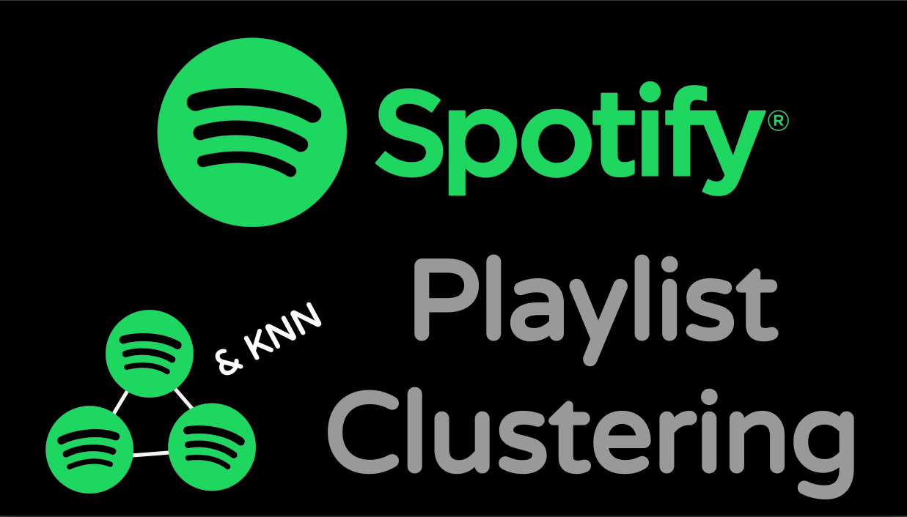
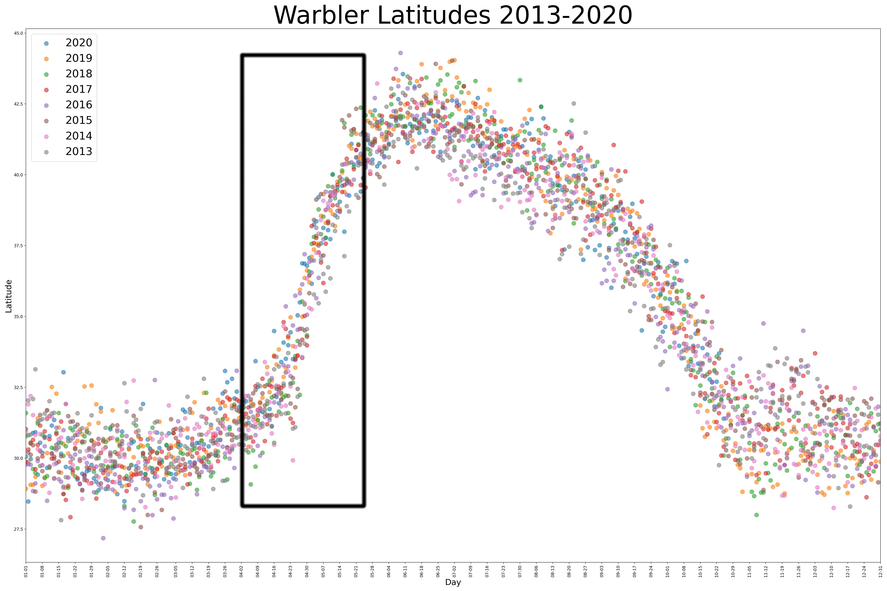

## Portfolio

---

### Data Science Capstones

[Neural Network Audio Classification](https://github.com/georgetballa/Audio_Instrument_Classifier)

Conversion of Audio Signals to Spectrograms for Transfer Learning using VGG-19 to Classify Musical Instruments

---
[Unsupervised Learning on Spotify Playlists](https://georgetballa.github.io/Spotify_Clustering/)

Combining Data Sources to describe Spotify Playlists, Perform Clustering Techniques on Playlists, Make recommendations and integrate with Spotify API

---
[Warbler Migration EDA and Hypothesis Testing](https://github.com/georgetballa/Warbler_Migration)

Analysis of Warbler Migration using eBird Data API, Hypothesis testing of Warbler Latitude Changes Year over Year

---

---

Page template forked from <a href="https://github.com/evanca/quick-portfolio">evanca</a>

<!-- Remove above link if you don't want to attibute -->
